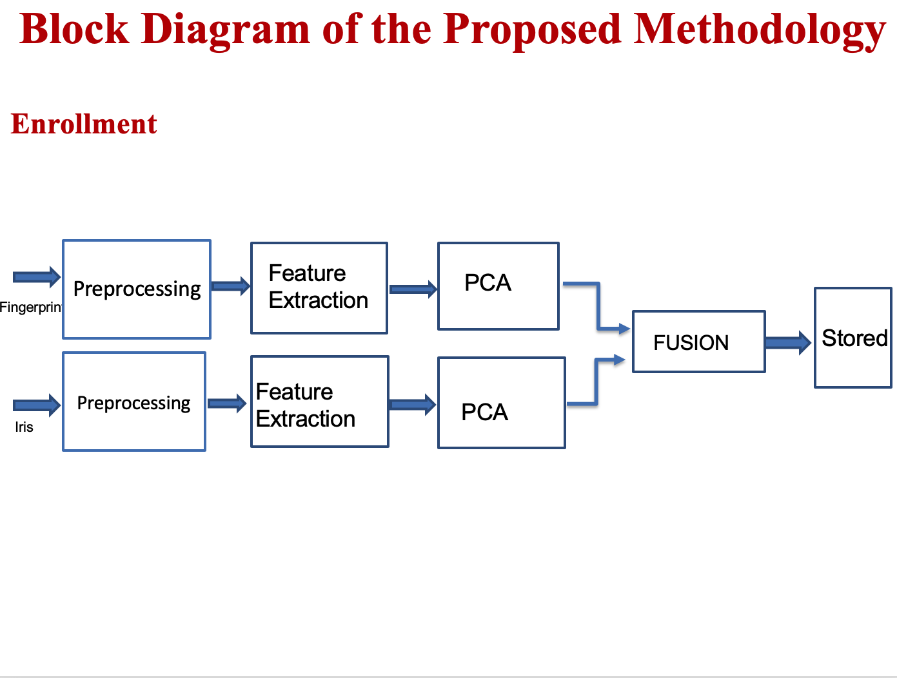

# Template-Protection-Using-Multimodal-Biometrics
Template Protection Using Multimodal Biometrics using Fingerprint and Iris 

# Bio-metrics :

Measurement and statistical analysis of people's unique physical and behavioral characteristics.

Mainly used for Security purpose.

Every person can be accurately identified intrinsic physical or behavioral traits.                                                                                                                                                                                                                                                                                                                                                                                                                                                                                                                       

